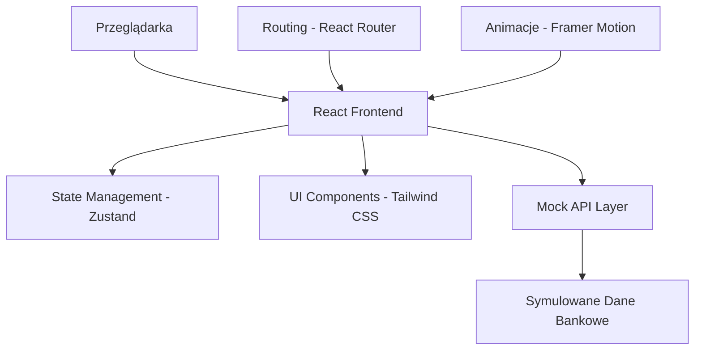

# Dokument Projektowy - Prototyp Aplikacji Bankowej dla Pracowników

## Przegląd

Prototyp aplikacji bankowej dla pracowników to nowoczesna aplikacja webowa zaprojektowana z myślą o efektywnej obsłudze klientów w środowisku bankowym. Aplikacja łączy w sobie funkcjonalność systemu CRM, narzędzi transakcyjnych i zarządzania kolejką w jednym spójnym interfejsie. Projekt kładzie nacisk na użyteczność, dostępność i nowoczesne wzorce UX/UI.

## Architektura

### Architektura Wysokiego Poziomu



### Struktura Aplikacji

- **Frontend Framework**: React 18 z TypeScript dla type safety
- **Styling**: Tailwind CSS dla szybkiego prototypowania i spójności
- **State Management**: Zustand dla prostego zarządzania stanem
- **Routing**: React Router dla nawigacji SPA
- **Animacje**: Framer Motion dla płynnych przejść
- **Mock Data**: JSON Server lub statyczne dane dla symulacji API

## Komponenty i Interfejsy

### 1. Layout System

#### MainLayout
- **Header**: Logo banku, informacje o zalogowanym pracowniku, powiadomienia
- **Sidebar**: Główna nawigacja z ikonami i etykietami
- **Content Area**: Dynamiczna zawartość stron
- **Footer**: Informacje systemowe, status połączenia

#### Navigation Structure
```
├── Dashboard (🏠)
├── Client Details (👤)
├── Transaction History (🕐)
├── Cards (💳)
├── Loans (💰)
├── Account Settings (⚙️)
├── Reports (📊)
├── Klienci (👥)
│   ├── Wyszukaj klienta
│   └── Lista klientów
├── Transakcje (💳)
│   ├── Nowy przelew
│   ├── Historia transakcji
│   └── Operacje gotówkowe
├── Kolejka (📋)
│   ├── Aktualna kolejka
│   └── Zarządzanie wizytami
└── Produkty (🏦)
    ├── Katalog produktów
    └── Wnioski
```

### 2. Core Components

#### Dashboard Component
- **KPI Cards**: Metryki dnia (obsłużeni klienci, transakcje, cele)
- **Quick Actions**: Szybkie akcje (nowy klient, przelew, kolejka)
- **Recent Activity**: Ostatnie aktywności i transakcje
- **Calendar Widget**: Nadchodzące spotkania i zadania
- **Notifications Panel**: Ważne powiadomienia systemowe

#### Customer Search & Profile
- **Search Bar**: Inteligentne wyszukiwanie z autouzupełnianiem w headerze
- **Customer Card**: Kompaktowy widok podstawowych informacji
- **Client Profile Section**: 
  - Avatar z inicjałami klienta
  - Nazwa klienta i data dołączenia
  - Status konta (Active/Inactive) z kolorowym oznaczeniem
  - ID klienta i przycisk edycji
- **Account Information Card**:
  - Numer konta z formatowaniem
  - Typ konta (Personal Checking, Business, etc.)
  - IBAN i SWIFT/BIC codes
  - Link do wszystkich kont klienta
- **Balance Card**:
  - Aktualny stan konta z dużą czcionką
  - Trend miesięczny z ikoną i kolorem
  - Przycisk "New Transaction"
- **Contact Information Card**:
  - Email, telefon, adres
  - Przycisk edycji z modalem
  - Formularz edycji z walidacją
- **Recent Transactions Table**:
  - Data, opis, kategoria, kwota
  - Kolorowe oznaczenia kategorii
  - Hover effects na wierszach
  - Link do pełnej historii

#### Transaction Module
- **Transaction Wizard**: Krokowy proces tworzenia transakcji
- **Amount Input**: Specjalizowany komponent do kwot z walidacją
- **Account Selector**: Wybór kont z podglądem sald
- **Confirmation Screen**: Podsumowanie przed wykonaniem
- **Receipt Generator**: Generowanie potwierdzeń

#### Queue Management
- **Queue Display**: Lista oczekujących z priorytetami
- **Customer Call**: System wywoływania klientów
- **Service Timer**: Śledzenie czasu obsługi
- **Queue Statistics**: Metryki kolejki w czasie rzeczywistym

#### Cards Management
- **Cards Overview**: Lista wszystkich kart klienta
- **Card Details**: Numer karty (maskowany), typ, limit, data ważności
- **Card Status**: Active/Blocked/Expired z kolorowym oznaczeniem
- **Card Actions**: Blokowanie, odblokowanie, zmiana limitów
- **New Card Application**: Kreator wniosku o nową kartę

#### Loans Management
- **Loans Overview**: Lista aktywnych kredytów i pożyczek
- **Loan Details**: Kwota, oprocentowanie, okres, pozostała kwota
- **Payment Schedule**: Harmonogram spłat z datami i kwotami
- **Loan Calculator**: Kalkulator rat dla nowych kredytów
- **Loan Application**: Kreator wniosku kredytowego

### 3. Design System

#### Color Palette
```css
/* Primary Colors - Bank Brand (Updated from UX Pilot) */
--primary-50: #f0f7ff;
--primary-100: #e0effe;
--primary-200: #bae0fd;
--primary-300: #7cc5fb;
--primary-400: #36a3f6;
--primary-500: #0c87e8;
--primary-600: #0069c5;
--primary-700: #0054a0;
--primary-800: #004784;
--primary-900: #00356d;

/* Secondary Colors */
--secondary-green: #059669;
--secondary-orange: #ea580c;
--secondary-red: #dc2626;

/* Status Colors for Categories */
--blue-100: #dbeafe;
--blue-800: #1e40af;
--green-100: #dcfce7;
--green-500: #22c55e;
--green-800: #166534;
--purple-100: #f3e8ff;
--purple-800: #6b21a8;
--yellow-100: #fef3c7;
--yellow-800: #92400e;
--red-500: #ef4444;

/* Neutral Colors */
--gray-50: #f9fafb;
--gray-100: #f3f4f6;
--gray-200: #e5e7eb;
--gray-400: #9ca3af;
--gray-500: #6b7280;
--gray-700: #374151;
--gray-800: #1f2937;
--gray-900: #111827;
```

#### Typography Scale
- **Headings**: Inter font family, weights 400-700
- **Body**: Inter font family, weight 400
- **Monospace**: JetBrains Mono dla numerów kont i kwot

#### Component Library
- **Buttons**: Primary, Secondary, Danger, Ghost variants
- **Forms**: Input fields, selects, checkboxes z walidacją
- **Cards**: Różne warianty dla różnych typów treści
- **Modals**: Overlay system dla formularzy i potwierdzeń
- **Tables**: Sortowalne tabele z paginacją
- **Charts**: Wykresy dla danych finansowych (Chart.js)

## Modele Danych

### Customer Model
```typescript
interface Customer {
  id: string;
  personalInfo: {
    firstName: string;
    lastName: string;
    pesel: string;
    dateOfBirth: Date;
    email: string;
    phone: string;
    address: Address;
  };
  bankingInfo: {
    customerSince: Date;
    segment: 'RETAIL' | 'PREMIUM' | 'PRIVATE';
    riskProfile: 'LOW' | 'MEDIUM' | 'HIGH';
    accounts: Account[];
    products: BankProduct[];
  };
  notes: Note[];
  lastActivity: Date;
}
```

### Transaction Model
```typescript
interface Transaction {
  id: string;
  type: 'TRANSFER' | 'DEPOSIT' | 'WITHDRAWAL' | 'PAYMENT';
  amount: number;
  currency: string;
  fromAccount: string;
  toAccount?: string;
  description: string;
  status: 'PENDING' | 'COMPLETED' | 'FAILED';
  timestamp: Date;
  employeeId: string;
  customerId: string;
}
```

### Queue Item Model
```typescript
interface QueueItem {
  id: string;
  customerId: string;
  customerName: string;
  serviceType: string;
  priority: 'LOW' | 'NORMAL' | 'HIGH' | 'URGENT';
  estimatedTime: number;
  arrivalTime: Date;
  status: 'WAITING' | 'IN_SERVICE' | 'COMPLETED';
  assignedEmployee?: string;
}
```

### Bank Product Model
```typescript
interface BankProduct {
  id: string;
  name: string;
  category: 'ACCOUNT' | 'LOAN' | 'INVESTMENT' | 'INSURANCE';
  description: string;
  features: string[];
  requirements: string[];
  interestRate?: number;
  fees: Fee[];
  isPromotional: boolean;
  promotionDetails?: PromotionDetails;
}
```

### Card Model
```typescript
interface Card {
  id: string;
  customerId: string;
  cardNumber: string; // Masked for security
  cardType: 'DEBIT' | 'CREDIT' | 'PREPAID';
  cardBrand: 'VISA' | 'MASTERCARD' | 'AMEX';
  status: 'ACTIVE' | 'BLOCKED' | 'EXPIRED' | 'PENDING';
  expiryDate: Date;
  creditLimit?: number;
  availableLimit?: number;
  issuedDate: Date;
  lastUsed?: Date;
}
```

### Loan Model
```typescript
interface Loan {
  id: string;
  customerId: string;
  loanType: 'PERSONAL' | 'MORTGAGE' | 'AUTO' | 'BUSINESS';
  principalAmount: number;
  currentBalance: number;
  interestRate: number;
  termMonths: number;
  monthlyPayment: number;
  nextPaymentDate: Date;
  status: 'ACTIVE' | 'PAID_OFF' | 'DELINQUENT' | 'DEFAULT';
  startDate: Date;
  paymentHistory: PaymentRecord[];
}
```

## Obsługa Błędów

### Error Boundary Strategy
- **Global Error Boundary**: Przechwytuje nieoczekiwane błędy
- **Component-Level Errors**: Lokalne obsługiwanie błędów formularzy
- **API Error Handling**: Centralizowana obsługa błędów API
- **User-Friendly Messages**: Przyjazne komunikaty zamiast technicznych błędów

### Error Types
```typescript
interface AppError {
  type: 'VALIDATION' | 'NETWORK' | 'AUTHORIZATION' | 'SYSTEM';
  message: string;
  details?: string;
  recoverable: boolean;
  actions?: ErrorAction[];
}
```

### Validation Strategy
- **Client-Side Validation**: Natychmiastowa walidacja formularzy
- **Schema Validation**: Zod dla walidacji typów TypeScript
- **Business Rules**: Walidacja reguł biznesowych (limity, uprawnienia)

## Strategia Testowania

### Unit Testing
- **Components**: React Testing Library dla komponentów UI
- **Utilities**: Jest dla funkcji pomocniczych
- **Hooks**: Testing Library Hooks dla custom hooks
- **Coverage Target**: 80% pokrycia kodu

### Integration Testing
- **User Flows**: Cypress dla testów end-to-end
- **API Integration**: MSW (Mock Service Worker) dla mock API
- **Cross-Browser**: Testowanie w Chrome, Firefox, Safari

### Accessibility Testing
- **WCAG 2.1 AA**: Zgodność ze standardami dostępności
- **Screen Reader**: Testowanie z NVDA/JAWS
- **Keyboard Navigation**: Pełna obsługa klawiatury
- **Color Contrast**: Sprawdzanie kontrastów kolorów

### Performance Testing
- **Core Web Vitals**: Monitoring LCP, FID, CLS
- **Bundle Size**: Analiza rozmiaru bundli
- **Loading Performance**: Testowanie na wolnych połączeniach
- **Memory Usage**: Monitoring wycieków pamięci

## Responsive Design Strategy

### Breakpoints
```css
/* Mobile First Approach */
sm: 640px   /* Telefony */
md: 768px   /* Tablety pionowo */
lg: 1024px  /* Tablety poziomo / Małe laptopy */
xl: 1280px  /* Desktopy */
2xl: 1536px /* Duże ekrany */
```

### Layout Adaptations
- **Mobile (< 768px)**: Pojedyncza kolumna, ukryta sidebar, bottom navigation
- **Tablet (768px - 1024px)**: Collapsible sidebar, adapted card layouts
- **Desktop (> 1024px)**: Pełny layout z sidebar, multi-column layouts

### Touch Interactions
- **Minimum Touch Target**: 44px x 44px dla wszystkich interaktywnych elementów
- **Gesture Support**: Swipe dla nawigacji, pull-to-refresh
- **Haptic Feedback**: Wibracje dla ważnych akcji (gdzie dostępne)

## Security Considerations

### Authentication & Authorization
- **Mock Authentication**: Symulacja logowania bez prawdziwej autoryzacji
- **Role-Based Access**: Różne poziomy dostępu dla różnych ról
- **Session Management**: Symulacja sesji użytkownika
- **Audit Trail**: Logowanie akcji użytkownika dla demonstracji

### Data Protection
- **Data Masking**: Maskowanie wrażliwych danych (numery kont, PESEL)
- **Mock Data Only**: Używanie tylko fikcyjnych danych klientów
- **No Real APIs**: Brak połączeń z prawdziwymi systemami bankowymi
- **Local Storage**: Minimalne użycie local storage, tylko dla UX